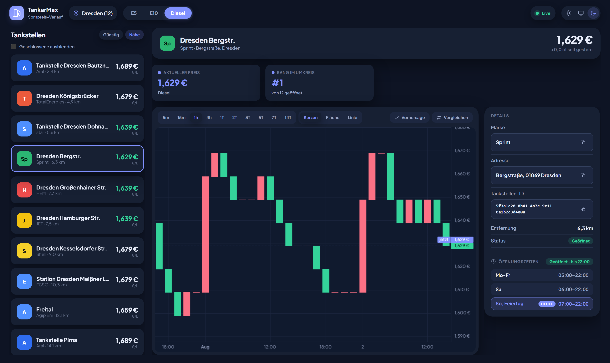
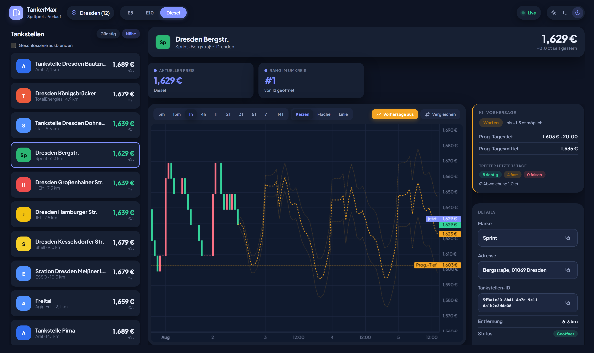
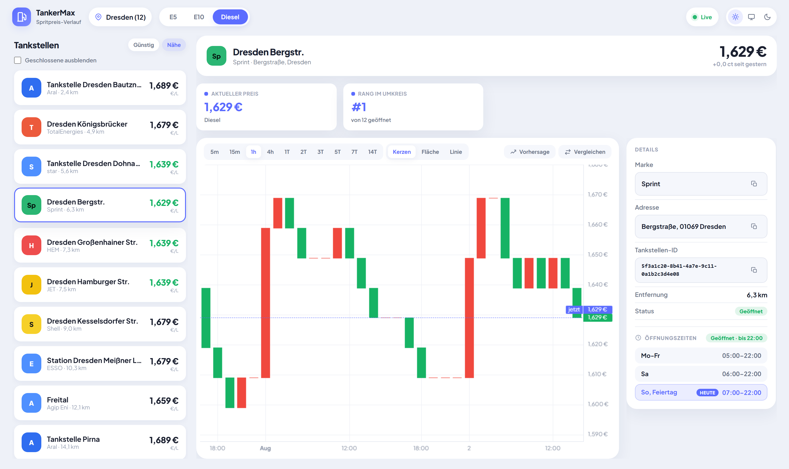

<div align="center">

# ⛽ TankerMax

**Spritpreise sammeln, auswerten und mit einer KI-Vorhersage in einem schlanken Dashboard anzeigen.**

[](https://github.com/lembergmax/TankerMax/actions/workflows/build.yml)
[](LICENSE)
[](https://openjdk.org/projects/jdk/21/)
[](https://spring.io/projects/spring-boot)
[](https://creativecommons.tankerkoenig.de)

</div>

---

TankerMax fragt die [Tankerkönig-API](https://creativecommons.tankerkoenig.de) nach einem festen
Zeitplan ab, legt Tankstellen, Marken, Kraftstoffarten und Preisbeobachtungen in **dritter
Normalform** in einer MariaDB ab und zeigt daraus Preisverlauf und **Preisvorhersage** in einem
Dashboard. Die Vorhersage läuft mit gradient-geboosteten Bäumen in **reinem Java** – ohne native
Bibliotheken und damit auch auf einem **Raspberry Pi**.

Das Projekt ist als Dauerläufer für zu Hause gedacht: Der Erfassungsdienst sammelt rund um die Uhr,
das Dashboard liest nur.

## Bildschirmfotos

> Die abgebildeten Daten sind synthetisch erzeugt und dienen nur der Darstellung – es sind keine
> echten Preise.

<div align="center">

### Dashboard mit Preisverlauf



### KI-Preisvorhersage mit Tanktipp



### Helles Erscheinungsbild



</div>

## Was TankerMax kann

- **Preise dauerhaft erfassen** – rotierende Abfrage mehrerer Orte, gedrosselt auf das von
  Tankerkönig erlaubte Maß (höchstens ein Aufruf pro Minute).
- **Sauberes Datenmodell** – Tankstellen, Marken, Kraftstoffarten, Öffnungszeiten und
  Preisbeobachtungen in dritter Normalform, statt einer breiten Rohdatentabelle.
- **Detaildaten anreichern** – Öffnungszeiten, Ausnahmen und Bundesland je Tankstelle.
- **Preisverlauf im Dashboard** – Kerzen-, Flächen- und Liniendarstellung mit Zeitfenstern von
  5 Minuten bis 14 Tagen, Vergleich mehrerer Tankstellen, Sortierung nach Preis oder Entfernung.
- **KI-Preisvorhersage** – stündliche Kurve über bis zu 72 Stunden, dazu ein **Tanktipp**
  („jetzt tanken" oder „warten") samt erwarteter Ersparnis.
- **Selbstkorrektur und Trefferquote** – jede Vorhersage wird später gegen den tatsächlichen Preis
  abgeglichen (*richtig* / *fast* / *falsch*); die gemessene systematische Abweichung fließt in die
  nächste Vorhersage ein.
- **Echtzeit-Aktualisierung** – neue Preise erscheinen über Server-Sent Events ohne Neuladen.
- **Hell/Dunkel-Umschaltung** und Tastatur- bzw. Screenreader-taugliche Bedienung.
- **Ohne externe Netzanfragen im Browser** – Schriftarten und Diagrammbibliothek liegen lokal bei;
  das Dashboard lädt nichts von einem CDN.

## Zwei Betriebsarten

Die Anwendung läuft um eine gemeinsame Datenbank in zwei Profilen. Ein Profil ist **Pflicht** –
`ActiveProfileGuard` bricht den Start sonst ab.

| Profil | Rolle | Web-Server |
|---|---|---|
| `ingest` | Kopfloser Dienst: fragt die Tankerkönig-API ab, schreibt Preise, trainiert die Vorhersage und berechnet die Kurve neu. | nein |
| `web` | Schreibgeschütztes Dashboard: statische Single-Page-App unter `/` und REST-API unter `/api`. Löst selbst keine API-Aufrufe aus und trainiert nichts. | ja |

Beide lassen sich gemeinsam in einem Prozess betreiben (`web,ingest`) – typisch für einen kleinen
Heimserver.

```
Tankerkönig-API ──▶ ingest ──▶ MariaDB (3NF) ──▶ web ──▶ Dashboard
                      │                            ▲
                      └──── KI-Vorhersage ─────────┘
```

Ausführlichere Diagramme liegen unter [`docs/diagramme`](docs/diagramme) (draw.io).

## Voraussetzungen

- **Java 21**
- **MariaDB** – Standard: Datenbank, Benutzer und Passwort jeweils `tankermax`. Das Schema legt
  Hibernate beim Start selbst an (`ddl-auto=update`); es gibt keine Migrationsskripte.
- **Tankerkönig-API-Schlüssel** – kostenlos unter
  [creativecommons.tankerkoenig.de](https://creativecommons.tankerkoenig.de) für die private
  Nutzung.
- **Docker** *(optional)* – nur für die Testcontainers-Integrationstests.

## Einrichtung

**1. Repository klonen**

```bash
git clone https://github.com/lembergmax/TankerMax.git
cd TankerMax
```

**2. Zugangsdaten hinterlegen** – `.env.example` nach `.env` kopieren und ausfüllen:

```bash
cp .env.example .env
```

```properties
TANKERKOENIG_API_KEY=dein-api-schlüssel
DB_URL=jdbc:mariadb://localhost:3306/tankermax?createDatabaseIfNotExist=true
DB_USERNAME=tankermax
DB_PASSWORD=tankermax
```

Durch `createDatabaseIfNotExist=true` legt der erste Start die Datenbank selbst an. Die `.env`-Datei
ist per `.gitignore` von der Versionskontrolle ausgeschlossen und gehört **niemals** in ein Commit.

**3. Orte festlegen** – die fachlichen Einstellungen stehen gebündelt im Abschnitt
**„Benutzer-Einstellungen"** ganz oben in
[`application.properties`](src/main/resources/application.properties):

```properties
tankerkoenig.locations[0].name=Dresden
tankerkoenig.locations[0].latitude=51.04
tankerkoenig.locations[0].longitude=13.79
tankerkoenig.locations[0].radius-km=25
tankerkoenig.locations[0].type=all
```

Es sind bis zu 15 Orte möglich. Pro Intervall wird genau ein Ort abgefragt, danach rotiert die
Abfrage – bei mehreren Orten also `tankerkoenig.poll.interval-ms` entsprechend senken.

## Starten

Mit dem mitgelieferten Maven-Wrapper – Windows `.\mvnw.cmd`, Linux/macOS `./mvnw`:

```bash
./mvnw spring-boot:run -Dspring-boot.run.profiles=ingest       # nur Erfassung (kopflos)
./mvnw spring-boot:run -Dspring-boot.run.profiles=web          # nur Dashboard
./mvnw spring-boot:run -Dspring-boot.run.profiles=web,ingest   # beides in einem Prozess
```

Das Dashboard läuft danach auf <http://127.0.0.1:8080>.

Gepacktes Jar bauen und starten:

```bash
./mvnw clean package
java -jar target/TankerMax-0.0.1.jar --spring.profiles.active=web,ingest
```

> **Hinweis zur Netzbindung:** `server.address` steht standardmäßig auf `127.0.0.1`, das Dashboard
> ist also nur lokal erreichbar. Wer es mit `0.0.0.0` ins Netz stellt, betreibt es **ohne
> Authentifizierung** – dann bitte einen Reverse-Proxy mit TLS und Zugangsschutz davorsetzen.

## Die KI-Preisvorhersage

Die Vorhersage nutzt **gradient-geboostete Entscheidungsbäume**
([Smile](https://haifengl.github.io), reines Java). Zwei Entwurfsentscheidungen prägen sie:

- **Vorhergesagt wird die Preis*änderung*, nicht der absolute Preis.** Baum-Modelle sind
  stückweise konstant und können nicht extrapolieren; ein absolutes Ziel würde zum Median des
  Trainingsfensters zurückfallen, sobald das Preisniveau daraus herausdriftet.
- **Die Tageszeit geht als reine Minute des Tages ein**, nicht als Sinus/Kosinus-Paar – Bäume
  trennen an Schwellenwerten, nicht an Winkeln.

Training und Auslieferung laufen getrennt: Trainiert wird nur alle `train-interval-days`
(Standard 3 Tage), dafür über den gesamten Datenbestand. Die **Kurve** entsteht dagegen bei
**jedem nächtlichen Lauf** neu, weil sie auf dem aktuellen Preis aufsetzt. Trainierte Modelle
werden serialisiert (`model-store-path`) und überleben Neustarts.

Alle Stellschrauben – Horizont, Auflösung, Trainingsfenster, Hyperparameter, Speicherobergrenzen –
sind in [`application.properties`](src/main/resources/application.properties) dokumentiert und auf
einen Raspberry Pi 5 abgestimmt.

## REST-API

Alle Endpunkte sind lesend und stehen nur im Profil `web` bereit.

| Endpunkt | Zweck |
|---|---|
| `GET /api/meta` | Verfügbare Kraftstoffarten und Grundeinstellungen |
| `GET /api/regions` | Konfigurierte Orte samt Anzahl der Tankstellen im Radius |
| `GET /api/stations` | Tankstellen einer Region mit aktuellem Preis |
| `GET /api/history` | Preisverlauf einer Tankstelle |
| `GET /api/forecast` | Vorhersagekurve, Unsicherheitsband und Tanktipp |
| `GET /api/stream` | Server-Sent-Events-Strom für die Echtzeit-Aktualisierung |
| `GET /actuator/health` · `/metrics` | Gesundheitsstatus und Kennzahlen |

## Tests

```bash
./mvnw test     # schnelle Unit-Tests (Surefire)
./mvnw verify   # zusätzlich die Docker-gestützten Integrationstests (Failsafe, *IT)
```

Die Integrationstests werden **ohne laufenden Docker-Daemon automatisch übersprungen**. Ein
Abdeckungsbericht (JaCoCo) entsteht unter `target/site/jacoco`.

Abgedeckt sind unter anderem Ratenbegrenzer, Preis-Deserialisierung, Öffnungszeiten-Auswertung, die
Web-Hilfsklassen sowie die gesamte Vorhersage-Pipeline – einschließlich der Zusicherung, dass
Preise *nach* dem Ausgangszeitpunkt den Merkmalsvektor nicht verändern (kein Blick in die Zukunft).

## Technik

| Bereich | Verwendet |
|---|---|
| Laufzeit | Java 21, Spring Boot 4.0.6, Maven |
| Datenhaltung | MariaDB, Spring Data JPA/Hibernate (3NF, `ddl-auto=update`) |
| Web | Spring MVC, Actuator, Caffeine-Cache, Server-Sent Events |
| Oberfläche | Vanilla JavaScript, [Lightweight Charts™](https://github.com/tradingview/lightweight-charts) – **kein Build-Schritt** |
| KI | [Smile](https://haifengl.github.io) `GradientTreeBoost` (LAD- und Quantil-Verlust), reines Java |
| Tests | JUnit 5, MockMvc, Testcontainers |

Die mitgelieferten Drittanbieter-Dateien samt Lizenz und Prüfsumme sind in
[`vendor/VENDOR.md`](src/main/resources/static/vendor/VENDOR.md) dokumentiert.

## Datenquelle und Namensnennung

Die Preisdaten stammen von **[Tankerkönig](https://creativecommons.tankerkoenig.de)** und stehen
unter der Lizenz **[CC BY 4.0](https://creativecommons.org/licenses/by/4.0/deed.de)**. Wer die
erfassten Daten weitergibt oder veröffentlicht, muss diese Namensnennung mitführen.

Die Nutzungsbedingungen von Tankerkönig sind einzuhalten – insbesondere die Begrenzung der
Aufrufhäufigkeit. Die Voreinstellungen dieses Projekts bleiben bewusst darunter.

> **Keine Gewähr:** TankerMax ist ein privates Projekt und steht in keiner Verbindung zu
> Tankerkönig oder einem Mineralölunternehmen. Angezeigte Preise und Vorhersagen können falsch
> oder veraltet sein und sind keine Grundlage für Kaufentscheidungen.

## Mitwirken

Beiträge sind willkommen – siehe [CONTRIBUTING.md](CONTRIBUTING.md) für Entwicklungsumgebung,
Code-Konventionen und den Ablauf für Pull Requests. Sicherheitsrelevante Funde bitte vertraulich
über den Weg in [SECURITY.md](SECURITY.md) melden.

## Lizenz

[MIT](LICENSE) © Max Lemberg

Die Lizenz gilt für den Quellcode dieses Projekts. Mitgelieferte Drittanbieter-Dateien und die über
die API bezogenen Preisdaten unterliegen ihren eigenen, oben genannten Lizenzen.
